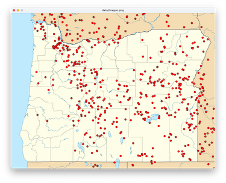
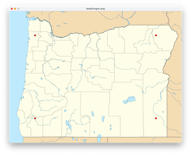
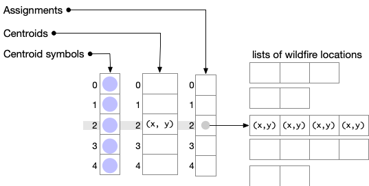
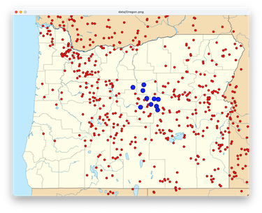

# HOWTO geographically cluster historical wildfire data


The small red dots in the screenshots above are locations of a past 
wildfire, recorded in a public database available from
[The National Interagency Fire Center.](
https://data-nifc.opendata.arcgis.com/datasets/nifc::wfigs-wildland-fire-locations-full-history)
The larger dots with rays out to the fire records represent the 
centroids of _clusters_ recorded fires.  The rays show which cluster 
each historical fire record is associated with. 

Clustering data is often an important step in working with large 
data sets.  It is considered an _unsupervised machine learning_ 
technique.  Sometimes clustering is useful in itself (e.g., we might 
cluster historical fire data to help determine where a new fire 
station is most needed), but more often it is a preliminary step for 
further analysis of a data set. 

The approach we will use to cluster locations of past wildfires is 
known as _naive k-means clustering_.  It is an example of a 
fundamental algorithmic approach in computing called _successive 
approximation_.  Successive approximation means gradually improving 
a guess until we have an acceptably good solution.  We can start 
with a very bad guess, as long as there is a way to improve it on 
each iteration of a loop.  In k-means clustering, we will start with 
a completely random assignment of wildfires to clusters.  Each time 
through the main loop, we will calculate the centroid of each 
cluster, then reassign wildfires to the cluster with the closest 
centroid.  For most practical datasets, naive k-means quickly 
_converges_ on good clusters. 

## Learning objectives

One of the objectives of this project, of course, is to introduce 
you to successive approximation as a problem-solving approach.  
K-means clustering is just one example of this approach.  We will 
see at least one more example of successive approximation applied to 
geometric data this term, the Douglas-Peucker algorithm that 
cartography and geographic information systems use to draw "good 
enough" approximations of complex shapes.

In addition, this project will give you a lot of practice in 
building and looping through lists.  Our approach will use a 
structure called _parallel arrays_, meaning that we will associate 
items in distinct lists with the same index.  We will use parallel 
arrays to associate each cluster with its graphical 
representation as a circle.  We will also use parallel arrays to 
associate each cluster with a list of wildfire locations. 

## Georeferenced data: Lat-Lon and UTM

Many available data sets included location information encoded as 
(latitude, longitude) pairs, which represent positions on the 
surface of a spheroid.  As our display media is generally flat 
rather than spherical, map displays require some _projection_ from 
spherical coordinates to a planar coordinate system.  There is no 
single _best_ projection.  Every projection from a spheroid onto a 
plane must necessarily distort something, whether that be direction 
or area or something else.  

For clustering records that are close together, we want to use a 
coordinate system that is good for calculating distance.  It is 
possible to calculate distance from (latitude, longitude) pairs, but 
it is quite complex.  The length of one degree of latitude or 
longitude varies with location, and the length of one degree of 
latitude is usually not the same as the length of one degree of 
longitude.  Translating one degree of longitude as the same distance 
everywhere is the reason Mercator projections make Greenland look as 
large as South America.  That doesn't mean Mercator is bad for 
all purposes, only that it is inappropriate for some purposes.

We will base our analysis on the data in `data/WFIGS_History.csv`, 
exported directly from a database provided by the National 
Interagency Fire Center.  This data is provided in the _comma 
separated values_ format, compatible with spreadsheets like Excel 
and Google Sheets as well as many database applications.  We can 
think of it as a grid in which each row is the record of a single 
wildfire, and each column is some attribute of wildfires.  Among the 
columns is one labeled `X`, for degrees longitude, and one labeled 
`Y`, for latitude.  This is the location data we need.  However, as 
we wish to cluster data by geographic distance, latitude and 
longitude (often called "lat-lon") are not easy to use.  

I have pre-processed this database into another file, 
`data/fire_locations_utm.csv`.  This is the same data, with two 
extra columns, `Easting`, `Northing`, and `UTM Zone`.  These columns 
represent location data using a map projection called
[Universal Transverse Mercator](
https://en.wikipedia.org/wiki/Universal_Transverse_Mercator_coordinate_system),
abbreviated UTM.  The unit of UTM coordinates is meters, relative to 
the origin of a _zone_.  Dividing earth's surface into zones avoids 
the extreme distortion of a Mercator projection, while using meters 
as units makes distance calculation easy, provided we are measuring 
distance between points in the same zone.

Most of Oregon is in UTM zone T10.  Some of eastern Oregon is in UTM 
zone T11.  I have translated all of the wildfire coordinates 
relative to zone T10, even if they properly belong to zone T11.  
This means that there will be some moderate distortion for the 
locations of points in eastern Oregon.  We will accept that much 
distortion for the sake of simple distance calculations.  _The 
distortion would be much worse, and would not be acceptable for a 
significantly larger area, like the 
whole of Europe or the continental United States_. 

## Basemap

We will plot wildfire records and clusters over a background map of 
Oregon.  This _basemap_ was produced using an equal-area projection, 
which is close but not identical to a projection based on UTM 
coordinates. It is close enough that we can get a reasonable idea of 
where recorded wildfires occur from the plot.

The UTM coordinates of wildfire data can be aligned with the basemap 
by noting the UTM coordinates of the lower-left and upper-right 
corners of region displayed in the basemap.  We can determine how 
many meters is represented by each pixel in the map image, and scale 
data coordinates proportionately.  I have provided 
`graphics/utm_plot.py` to plot points with this scaling. File 
`config.py` contains the reference information for alignment. 

##  Getting started: A basic plot

I like to start a project that involves graphics or plots with a 
basic data display, before beginning any analysis.  That provides 
some reassurance that the data I am working with is reasonable, and 
it helps me quickly visualize other information to debug my mistakes.
For example, when I was preparing this project, I plotted four 
points at the north, south, east, and west corners of the mapped 
area.  At first they all appeared in eastern Oregon, because my 
translation of UTM coordinates to pixel coordinates was wrong.

### Skeleton

Start with the usual skeleton for an application that includes 
doctests. 

```python
"""Geographic clustering of historical wildfire data
CS 210, University of Oregon
Your Name Here
Credits: TBD
"""
import doctest


def main():
    doctest.testmod()

if __name__ == "__main__":
    main()
```

We will be taking data from a comma-separated values file, so add 
`import csv` just after the import of `doctest`.   We will also need 
to import the provided `utm_plot` module, which is in subdirectory 
`graphics`.  [Python style guidelines](
https://peps.python.org/pep-0008/#imports) recommend placing "local"
imports after imports of system library modules, like this: 

```python
import doctest
import csv

import graphics.utm_plot
```

To use the `utm_plot` module, we will need information about the 
basemap (its size in pixels, and its extent in UTM coordinates).  
This information is kept separately from `wildfire.py`, in `config.
py`. Add an `import` statement for `config`.  If you execute the 
module again, it still doesn't do anything (there are no tests to 
run yet), but it should execute without errors. 

### Add the basemap

I always feel better when I get _something_ to display.  Let's 
create the basemap image and display it.  The image is in portable 
network graphics (PNG) form, in file `data/Oregon.png`.  Our 
`config` module includes that information, along with information 
about coordinates of the corners of the area represented by the 
basemap. We'll put creation of the map display in a function: 

```python
def make_map() -> graphics.utm_plot.Map:
    """Create and return a basemap display"""
    map = graphics.utm_plot.Map(config.BASEMAP_PATH,
                                config.BASEMAP_SIZE,
                                (config.BASEMAP_ORIGIN_EASTING, config.BASEMAP_ORIGIN_NORTHING),
                                (config.BASEMAP_EXTENT_EASTING, config.BASEMAP_EXTENT_NORTHING))
    return map
```

Now we will need only a single line in our `main` function to 
create and display the map.  However, if we just create it and then 
end the program, the map will display momentarily and disappear.  
We'll add one more line to keep the display visible until the user 
presses enter. 

```python
def main():
    doctest.testmod()
    fire_map = make_map()
    input("Press enter to quit")
```

You should see something like this: 


### Read the data

We will use a  `csv.DictReader` to read the wildfire data.  You may 
wish to 
refer to code you have written with a `DictReader` to read course 
enrollment data, and you may wish to refer to the
[Python library documentation](
https://docs.python.org/3/library/csv.html) for the `csv` module.

Although the dataset contains a lot of information, for now we just 
want the UTM coordinates of each recorded wildfire. These 
coordinates are in the `Easting` and `Northing` columns (which you 
can think of as the `x` and `y` coordinates of a graph with the 
origin at the southwest corner of the area).  

```python
def get_fires_utm(path: str) -> list[tuple[int, int]]:
    """Read CSV file specified by path, returning a list 
    of (easting, northing) coordinate pairs within the 
    study area. 
    
    >>> get_fires_utm("data/test_locations_utm.csv")
    [(442151, 4729315), (442151, 5071453), (914041, 4729315), (914041, 5071453)]
    """
```

You will need to specify the encoding and line-ending conventions 
for the input file, like this: 

```python
    with open(path, newline="", encoding="utf-8") as source_file:
        reader = csv.DictReader(source_file)
```

UTF-8 is the most common of several possible encodings of the 
Unicode character set, which supports characters from many languages 
around the world.  I am not certain why the specification of the 
line-ending convention is required, but the csv module 
documentations says we need it when using a `DictReader`, so here it 
is.  I know these are necessary because encountered errors until I 
added `newline=""` and `encoding="utf-8"`. 

Note that the data we read from the input file is all text.  The 
string value `"554203"` is not a number, even though all of its 
characters are digits!  It is a string that 
can be converted to an integer (type `int`), like this: 

```python
   easting = int(row["Easting"])
```

Although the records in `data/fire_locations_utm.csv` are mostly 
within the area of the map, a few are outside.  It's a good idea to 
exclude these.  We can write a function to determine whether a point 
is within or outside the map area, using information from `config.py`:

```python
def in_bounds(easting: float, northing: float) -> bool:
    """Is the UTM value within bounds of the map?"""
    if (easting < config.BASEMAP_ORIGIN_EASTING
        or easting > config.BASEMAP_EXTENT_EASTING
        or northing < config.BASEMAP_ORIGIN_NORTHING
        or northing > config.BASEMAP_EXTENT_NORTHING):
        return False
    return True
```

Write `get_fires_utm` to return a list of coordinate pairs that are 
within bounds of the mapped area.  The test file 
`data/fire_locations_utm.csv` provides data for the included 
test case, including two points that should be excluded because they 
are outside the study area. 

### Plot the data

Plotting the fire data is now straightforward. Our `make_map` 
function returned a reference to the display.  We will create a 
`plot_points` function to plot a list of (easting, northing) pairs 
on the basemap.  Although the wildfire points will not move, later 
we'll use the same function to point our evolving estimates of the 
cluster centroids, so we'll return a list of references to the 
graphics objects for each point. 

```python
def plot_points(fire_map: graphics.utm_plot.Map,
                points:  list[tuple[int, int]],
                size_px: int = 5,
                color: str = "green") -> list:
    """Plot all the points and return a list of handles that
    can be used for moving them.
    """
    symbols = []
    for point in points:
        easting, northing = point
        symbol = fire_map.plot_point(easting, northing, 
                                     size_px=size_px, color=color)
        symbols.append(symbol)
    return symbols
```

Note that this function header includes two _keyword parameters_, 
`size_px` and `color`.  These specify default values that can be 
overridden.  If we call 

```python
    fire_symbols = plot_points(map, points, color="red")
```
we will override the default green color to make the plot points red,
but they will be plotted at the default size of 5 pixels. 

We can add two lines to our main program: 

```python
    points = get_fires_utm(config.FIRE_DATA_PATH)
    fire_symbols = plot_points(fire_map, points, color="red")
```

This should create a display like this: 



If your display does not look like this, or if you just want to gain 
confidence that it is acting reasonably, you can substitute the test 
data from `test_locations_utm.csv`, like this: 

```python
    #points = get_fires_utm(config.FIRE_DATA_PATH)
    points = get_fires_utm("data/test_locations_utm.csv")
```

The test data is four points approximately 100km from the east, west,
north, and south boundaries, which should give a display that looks 
like this: 



## Parallel lists

Now that we have our dataset and are able to plot it, it is time to 
take on the core of our project, which is to find _clusters_ of fire 
records.   We will do that by successive approximation:  We will 
first make a _very bad_ guess as to how to group data, and then we 
will enter a loop, refining our guesses.  

We will represent groupings using parallel arrays:  

- One list will hold centroids of our current set of clusters.
- Another list will hold lists of points assigned to clusters
- The indexes of the list of centroids will be the same as the 
  indexes of the lists of assigned points. 

In addition we will keep a list of the graphic symbols (circles) 
used to represent each centroid on the map, again with the same 
indexes.  We will need that so that we can move those circles around 
on the display as our estimates improve. 



In the illustration, we can see that the graphic symbol at index 2, 
the centroid coordinates at index 2, and the list of wildfire 
locations (taken from our list `points`) all refer to the same cluster.

How can we make an initial bad guess?  Let's make it random.  I will 
provide an implementation of random assignment, which you may find 
useful as a starting point for the improved assignment step that I 
will ask you to do create shortly. 

You will need to add `import random` to the sequence of import 
statements near the beginning of your application.  Then you can
include this function for returning a random assignment to _n_ 
clusters.

```python
def assign_random(points: list[tuple[int, int]], n: int) -> list[list[tuple[int, int]]]:
    """Returns a list of n lists of coordinate pairs.
    The i'th list is the points assigned randomly to the i'th cluster.
    """
    # Initially the assignments is a list of n empty lists
    assignments = []
    for i in range(n):
        assignments.append([])
    # Then we randomly assign points to lists
    for point in points:
        choice = random.randrange(n)
        assignments[choice].append(point)
    return assignments
```

The header of `assign_random` might look intimidating.  It's not too 
bad if we break it down.  First, consider

```python
points: list[tuple[int, int]]
```
This says points is a list, and each element of the list is a pair 
of integers.  In other words, this looks like our list of wildfire 
coordinate pairs. 

Next we have `n`, an integer that says how many lists of points we 
should make.   We use it first to create enough empty lists: 

```python
    assignments = []
    for i in range(n):
        assignments.append([])
```

and later we use `n` to randomly choose a one of the lists to add a 
point to. 

The result type for this function is 

```python
list[list[tuple[int, int]]]
```

Let's just work from the inside out. The innermost part is
`tuple[int, int]`, which is our representation of a coordinate pair. 
These are kept in a list, which will be the list of points assigned 
to one cluster, i.e., the _assignment of points_ to this cluster.  
We will have `n` clusters, so we need a list of `n` assignments. 

In our main function, we can create this initial random assignment of 
points to clusters: 

```python
    partition = assign_random(points, config.N_CLUSTERS)
```

Considering this is a _random_ assignment of points to clusters, I 
cannot think of a way to write a test case for it.  Shortly, though, 
we can create a graphical display to at least give us an idea of 
whether it looks like a random assignment. 

## Centroids

We will use a very simple definition of the centroid of a set of 
points: The x coordinate of the centroid will be the average 
(arithmetic mean) of the x coordinates of points in the set, and the 
y coordinate will be the arithmetic mean of the y coordinates of the 
individual points.   Since we are using integer coordinates for points, 
we'll also use integer coordinates for the centroid. This 
might be 
a problem if we were plotting points in a very small area, but for a 
map at the scale of an entire state, accuracy within a meter or two 
is fine.  Don't bother with rounding; just use the `//` integer 
division operation, which will be off by at most half a meter.

```python
def centroid(points: list[tuple[int, int]]) -> tuple[int, int]:
    """The centroid of a set of points is the mean of x and mean of y"""
```

You will need to loop through `points`, keeping a sum for the `x` 
coordinates and a sum for the `y` coordinates. You can then divide 
each by `len(points)` to get the mean.  You may note that this is 
another instance of the _accumulator pattern_ that we saw in the 
course enrollment analysis. 

To keep our main function short, we can write a very simple function 
for computing the centroids of all the clusters: 

```python
def cluster_centroids(clusters: list[list[tuple[int,int]]]) -> list[tuple[int,int]]:
    """Return a list containing the centroid corresponding to each assignment of
    points to a cluster.
    """
    centroids = []
    for cluster in clusters:
        centroids.append(centroid(cluster))
    return centroids
```

I'm too impatient to write a test case for this simple function, but 
I'll come back to it if the next step doesn't work.  We'll call 
cluster_centroids 
in the main function like this: 

```python
    centroids = cluster_centroids(partition)
```

## Plot the centroids

We already have a function for plotting a set of (easting, northing) 
pairs on the map.  We can plot the cluster centroids with a call to 
the same function, just varying the color and size to make them 
visually distinctive: 

```python
    centroid_symbols = plot_points(map, centroids, size_px=10, color="blue")
```

You should see somethign like this (but not precisely, because the 
random assignment will be a little different each time you run the 
program):



Notice that the centroids are near the center of the plot.  Can you 
explain why?  Discuss with your classmates why we should usually 
expect the initial centroids to be near the center.  If you 
understand it, try explaining to a classmate.  If you don't 
understand it, give a classmate an opportunity to explain it to you. 
Finding a clear way to explain something is a good way to deepen 
your own understanding, and often leads to new insights. 

## Improving the clusters

Now we have a way of making a very bad guess at the clusters.  The 
successive approximation method works by improving a guess, over and 
over until we are satisfied or stop making progress. 

Our bad guess came from randomly assigning points to clusters.  We 
can improve it by assigning points to the _nearest_ cluster.  To 
determine which cluster is nearest, we will calculate the distance 
from each point to each cluster centroid ... almost.  

Euclidean 
distance between $(x_1, y_1)$ and $(x_2, y_2)$ is 
$$\sqrt{(x_2 - x_1)^2 + (y_2 - y_1)^2}$$.
However, we don't really 
need to know the distance between points.  We just need any 
_monotone function_ of distance.  A function _f_ is _monotone_ if 
$$ x \gt y \rightarrow f(x) \gt f(y) $$.  The square of distance, 
which we get if we just skip taking the square root of
$$(x_2 - x_1)^2 + (y_2 - y_1)^2$$, is a monotone function of 
distance:  The greater the distance, the greater the square of 
distance.  So instead of finding the cluster with the smallest 
distance from a point, we can find the cluster with the smallest 
squared distance from a point.  This has the added advantage of 
working well with integers.  


